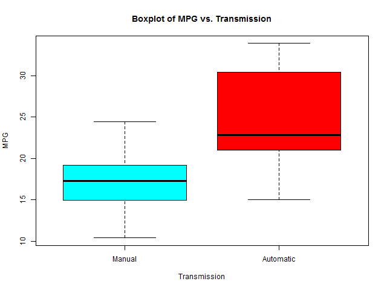
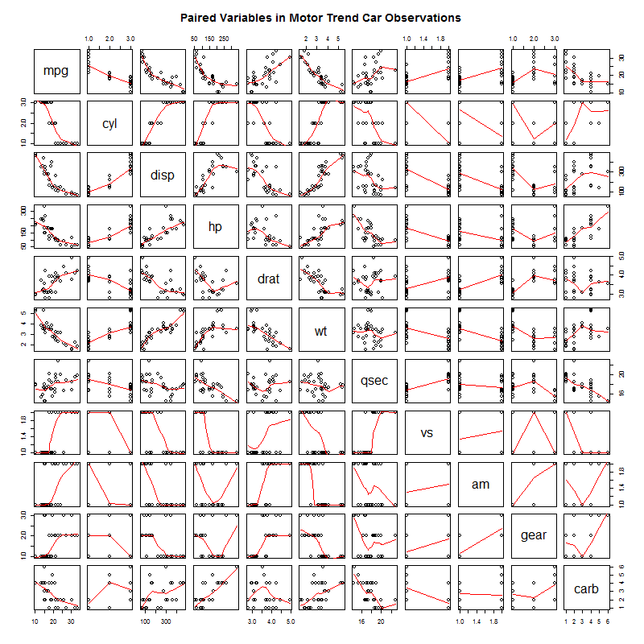
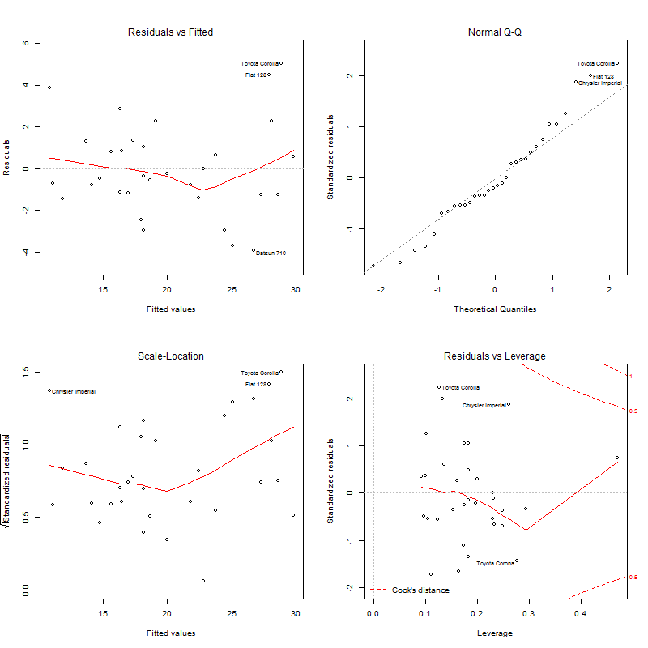

## Executive Summary  
This report is meant to observe and analyze the data contained in the dataset `mtcars` and to explore the relationship between some of the cars' characteristics with their miles per gallon (MPG) performance. The `mtcars` dataset was obtained from the 1974 `Motor Trend` Magazine, and contains 11 factors that seemingly affect an automobile's performance for 32 cars. For this study we treat the cars' transmission type (am) as the main factor related to how much the MPG value is affected, we do this through exploratory data analyses and regression models. We also evaluate this transmission-MPG relationship when other performance factors affect this relationship. We show that there is actually a difference between cars that use an automatic or manual transmission and the MPG that these cars average.

The results of this study show that the MPG that a car averages vary in direct correlation to wether the car uses a manual or an automatic transmission, it also shows that this correlation is affected and becomes less significant when some other factors that seem to also show a strong correlation to the car's MPG performance are added to the model. The factors chosen because of their correlation to MPG were the number of engine cylinders in the car `cyl`, the maximum horse power produced by the car `hp` and the car's weight `wt`. The model that takes these three factors as confounders and the transmission type `am` as the independent variable to predict a car's MPG performance, results the best possible model to predict a car's mileage per gallon, accounting for about 84% of the variability of this measure.


## Data loading and transformation
First, we load the data set `mtcars` and change some variables from `numeric` class to `factor` class. We also load the library `ggplot2` since we will be using it later. 

```r
library(ggplot2)
data(mtcars)
```
 We can observe the variables collected for the dataset:
```r
str(mtcars) ## Results hidden
```
Now we transform the necessary variables to factors

```r
mtcars$cyl <- factor(mtcars$cyl)
mtcars$vs <- factor(mtcars$vs)
mtcars$gear <- factor(mtcars$gear)
mtcars$carb <- factor(mtcars$carb)
mtcars$am <- factor(mtcars$am,labels=c('Automatic','Manual'))
```
And now we can observe how the data has changed:

```r
'data.frame':    32 obs. of  11 variables:
$ mpg : num  21 21 22.8 21.4 18.7 18.1 14.3 24.4 22.8 19.2 ...
$ cyl : Factor w/ 3 levels "4","6","8": 2 2 1 2 3 2 3 1 1 2 ...
$ disp: num  160 160 108 258 360 ...
$ hp  : num  110 110 93 110 175 105 245 62 95 123 ...
$ drat: num  3.9 3.9 3.85 3.08 3.15 2.76 3.21 3.69 3.92 3.92 ...
$ wt  : num  2.62 2.88 2.32 3.21 3.44 ...
$ qsec: num  16.5 17 18.6 19.4 17 ...
$ vs  : Factor w/ 2 levels "0","1": 1 1 2 2 1 2 1 2 2 2 ...
$ am  : Factor w/ 2 levels "Automatic","Manual": 2 2 2 1 1 1 1 1 1 1 ...
$ gear: Factor w/ 3 levels "3","4","5": 2 2 2 1 1 1 1 2 2 2 ...
$ carb: Factor w/ 6 levels "1","2","3","4",..: 4 4 1 1 2 1 4 2 2 4 ...
```
## Exploratory data analysis
The first thing to do, is to analyze the correlations between the observed variables to determine our variables of interest, we do this initially by plotting all relationships between variables of our `mtcars` dataset (**Figure 1 in the Appendix**), by observation, we can notice that variables like `cyl`, `disp`, `hp`, `qsec` and `am` seem to have strong correlations with `mpg`, so we will need to quantify this correlations by using linear models before drawing any conclusions.

We also need to establish the effect that using a manual or automatic transmission has on the cars' MPG performance, we can clearly observe this by doing a box plot of the `mpg` variable for each of the transmission types (**Figure 2 in the Appendix**). The observable result is that there is a direct correlation between this variables, and that there is a visible increase in the cars' MPG performance when the transmission is manual.


## Regression Analysis
We need to create our base linear model that represents the relation between the `mpg` and the rest of the variables, and then there are some model tests that we have to do to find out which is the best model fit, afterwards we compare them to the original base linear model (we use the `anova` tool for this step). Once we have selected the best model fit, we proceed to do a residuals analysis.

Based on the initial observations of the pairs plot where several variables show a visible correlation with `mpg`, we need to build a model with all the variables as predictors, and then do a selection to detect significant predictors for the best possible model. We may do this using the 'step' method, this method runs lm multiple times to build regression models and then selects the best variables from the models by using forward selection and backward elimination methods using the 'AIC' algorithm.

```r
basemod <- lm(mpg ~ ., data = mtcars)
bestmod <- step(basemod, direction = "both")
```

The best model obtained includes the variables `cyl`, `hp`, `wt` and `am`. We may now observe the best possible model:

```r
summary(bestmod)

## Call:
## lm(formula = mpg ~ am + cyl + hp + wt, data = mtcars)

## Residuals:
##     Min      1Q  Median      3Q     Max 
## -3.9387 -1.2560 -0.4013  1.1253  5.0513 

## Coefficients:
##             Estimate Std. Error t value Pr(>|t|)    
## (Intercept) 33.70832    2.60489  12.940 7.73e-13 ***
## amManual     1.80921    1.39630   1.296  0.20646    
## cyl6        -3.03134    1.40728  -2.154  0.04068 *  
## cyl8        -2.16368    2.28425  -0.947  0.35225    
## hp          -0.03211    0.01369  -2.345  0.02693 *  
## wt          -2.49683    0.88559  -2.819  0.00908 **    
## ---
## Signif. codes:  0 ‘***’ 0.001 ‘**’ 0.01 ‘*’ 0.05 ‘.’ 0.1 ‘ ’ 1

## Residual standard error: 2.41 on 26 degrees of freedom
## Multiple R-squared:  0.8659,    Adjusted R-squared:  0.8401 
## F-statistic: 33.57 on 5 and 26 DF,  p-value: 1.506e-10
```
The model has a Residual standard error of 2.41 and 26 degrees of freedom. The Adjusted R-squared value is 0.8401, which means that the model explains about 84% of the variability of the MPG performance of the car. 

```r
anova(basemod, bestmod)

## Analysis of Variance Table

## Model 1: mpg ~ cyl + disp + hp + drat + wt + qsec + vs + am + gear + carb
## Model 2: mpg ~ am + cyl + hp + wt
##   Res.Df    RSS  Df Sum of Sq      F Pr(>F)
## 1     15 120.40                            
## 2     26 151.03 -11   -30.623 0.3468 0.9588
```

By looking the values on the `anova` table, we can observe that the p-value is highly significant, so we reject the null hypothesis, which states that the variables `am`, `cyl`, `hp` and `wt` don’t contribute significantly to the accuracy of the model. Now we can be sure that we have the best possible model to predict the MPG performance of a car.


## Inference  
We test the null hypothesis that claims the car's transmission has no significant effect on the cars MPG performance (assuming the MPG has a normal distribution). We use the t-Test as our tool.

```r
result <- t.test(mpg ~ am)
result$p.value

## [1] 0.001373638
```

```r
result$estimate

## mean in group 0 mean in group 1 
##        17.14737        24.39231
```
Since the p-value is 0.00137, we reject our null hypothesis and we can accurately say that the car's transmission has a direct impact in the car's MPG performance. On average, a car with a manual transmission will give 7.25 MPG more than automatic transmitted cars.  

Then, we must create our model to represent the relationship between the transmission type and the MPG performance:

```r
ammod<-lm(mpg ~ am, data=mtcars)
summary(ammod)
## Call:
## lm(formula = mpg ~ am, data = mtcars)

## Residuals:
##     Min      1Q  Median      3Q     Max 
## -9.3923 -3.0923 -0.2974  3.2439  9.5077 

## Coefficients:
##             Estimate Std. Error t value Pr(>|t|)    
## (Intercept)   17.147      1.125  15.247 1.13e-15 ***
## am             7.245      1.764   4.106 0.000285 ***
## ---
## Signif. codes:  0 ‘***’ 0.001 ‘**’ 0.01 ‘*’ 0.05 ‘.’ 0.1 ‘ ’ 1

## Residual standard error: 4.902 on 30 degrees of freedom
## Multiple R-squared:  0.3598,    Adjusted R-squared:  0.3385 
## F-statistic: 16.86 on 1 and 30 DF,  p-value: 0.000285

```
We can clearly see that a car gives on average 17.147 MPG with an automatic transmission, while cars with manual transmissions give on average 7.245 MPG more than cars with automatic transmissions. However this model can only explain about 33% of the variance of the MPG variable, while our best fitted model can account for about 83% of the MPG variance, so we may use our best fitted model for predictive behavior of the `mpg` variable.

  

## Residual Analysis and Diagnostics  
Now we may create the residual plots (**Figure 3 in the Appendix**) from which we can make the following observations:

1. The Residuals vs. Fitted plot does not show a consistent pattern, this supports the accuracy of the independence assumption.  
2. The Normal Q-Q plot clearly shows the residuals are normally distributed, as all values fall close to the line.  
3. The Scale-Location plot shows points scattered in a constant pattern, which indicates a constant variance. 
4. There are some outliers in the plots. However if we test the Dfbetas, which is the measure of how much an observation affects the estimate of a regression coefficient, we find that none of the Dfbeta values is gretaer than 1, meaning no observation affects significantly the estimate of a variable's regression coefficient.

```r
sum((abs(dfbetas(bestmod)))>1)

## [1] 0
```
## Conclusions

Now that we have proven that we have our best model, we may perform several observations of the model and conclude:

* Cars equipped with a manual transmission give more miles per gallon than cars equipped with automatic transmissions by a factor of 1.81. This is true for when the number of cylinders in the car, maximum horse power and the weight of the car are accounted for in the equation.
* The total miles per gallon a car can give will decrease by a factor 2.5  for every 1000 lb increase in the car's weight. This is true when for when the the number of cylinders in the car, maximum horse power and transmission type of the car are accounted for in the equation.
* Cars that have 6 cylinder engines give less miles per gallon than cars with 4 cylinder engines by a factor of 2.16. This is true when for when weight, maximum horse power and transmission type of the car are accounted for in the equation.
* Cars that have 8 cylinder engines give less miles per gallon than cars with 4 cylinder engines by a factor of 3. This is true when for when weight, maximum horse power and transmission type of the car are accounted for in the equation.
* When a car's hp is increased, the car's mileage per gallon will be reduced by a factor of 0.32, this appears to be very little, yet we must remember this is only true for when the weight, the number of engine cylinders and the transmission type of the car are taken into account.


## Appendix  

##### Figure 1. 

Boxplot of MPG vs. Transmission  

```r
boxplot(mpg ~ am, xlab="Transmission", ylab="MPG", main="Boxplot of MPG vs. Transmission", data=mtcars, 
        names=c("Manual", "Automatic"), col=c("cyan","red"))
```

  

##### Figure 2.

Paired Variables in Motor Trend Car Observations 

```r
pairs(mtcars, panel=panel.smooth, main="Paired Variables in Motor Trend Car Observations")
```

 


##### Figure 3.

Best model plots  


```r
par(mfrow = c(2, 2))
plot(bestmod)
```

  
